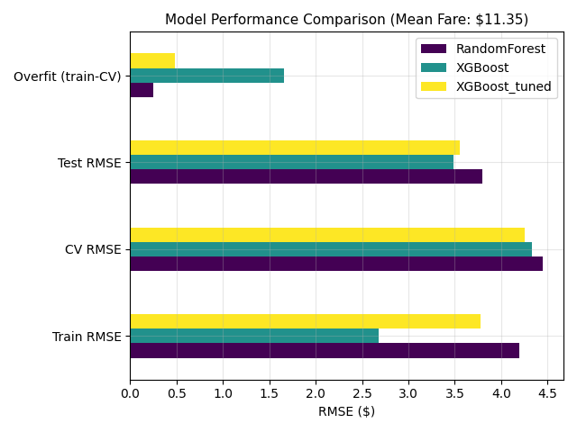
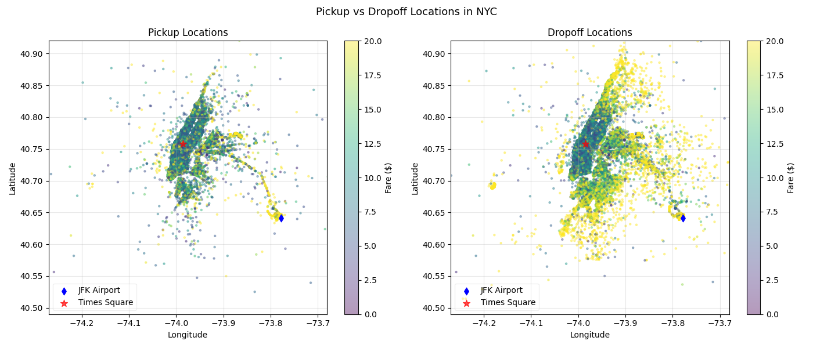
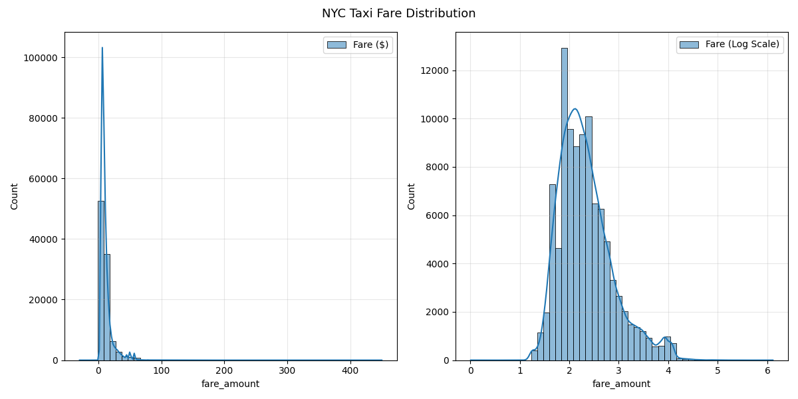
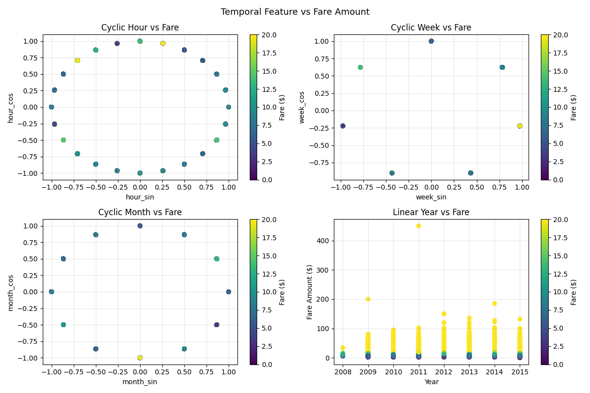
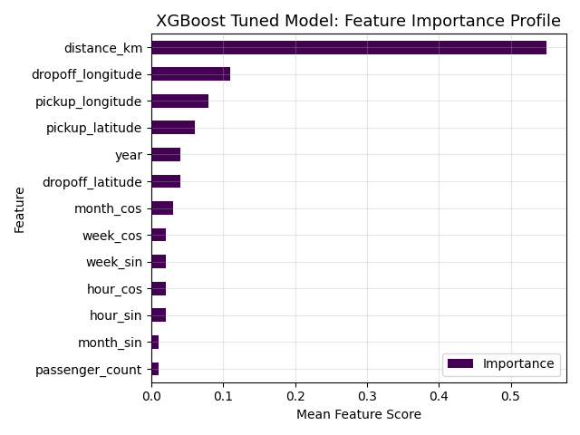

# 🚕 NYC Taxi Fare Prediction

End-to-end machine learning project for predicting NYC taxi fares using XGBoost and Random Forest.

---

## 📊 Project Highlights & Metrics

- **Baseline Model**: Mean `fare_amount` from the training set = $11.35
- **Feature engineering**: Implemented Haversine distance and cyclical time encoding.
- **Best Model**: XGBoost (Tuned) — Test RMSE: $3.55
- **Overfitting Gap Reduced**: 1.66 → 0.48 (71% improvement)

## 🎛️ Hyperparameter Optimization Strategy

* 📉 **Learning Rate (0.05) & Max Depth (4):** Smaller steps and shallower trees to avoid overfitting.
* 🛡️ **L1 Regularization (0.5):** To shrink uninformative features to improve generalization.
* 🎲 **Subsampling (Rows: 0.8, Columns: 0.7):** Random row and feature variations to ensure no single outlier dominates the model.

### Model Performance Evaluation


---

## 🎨 Visualizations

### Locations Analysis

> Pickups concentrated in Manhattan · Dropoffs dispersed across all boroughs · JFK strip pattern ($20+ flat-rate) visible at lower right

### Fare Distribution

> Highly right-skewed (median ~$8.5, max ~$263)

### Temporal Features vs Fare

> Cyclic encoding for hour, week and month ensures boundary values are adjacent

### Feature Importance

> `distance_km` dominates (55%) · Passenger count near-zero (NYC flat-rate per trip, not per passenger)

---

## 📈 Key Findings

- **Distance** is the strongest predictor (validates Haversine feature).
- **Longitude** captures airport trip variance (East-West corridor trends).
- **Passenger count** has minimal impact (aligns with NYC flat-rate pricing).
- **Year** captures fare inflation over time.
- **Regularisation** reduced overfitting gap 71% ($1.66 → $0.48) with negligible test performance cost

---


## 🚀 Quick Start

```bash
# Clone repository
git clone https://github.com/aguchhait-stack/nyc-taxi-fare-prediction.git
cd nyc-taxi-fare-prediction

# Install dependencies
pip install -r requirements.txt

# Explore notebook
jupyter notebook nyc-taxi-fare-prediction.ipynb
```

## 📄 License & Citation

This project uses the [New York City Taxi Fare Prediction](https://kaggle.com/competitions/new-york-city-taxi-fare-prediction) dataset 
from Kaggle.

---

## 👨‍💻 Author

**Arijit Guchhait**  
[LinkedIn](https://www.linkedin.com/in/guchhaitarijit/)

